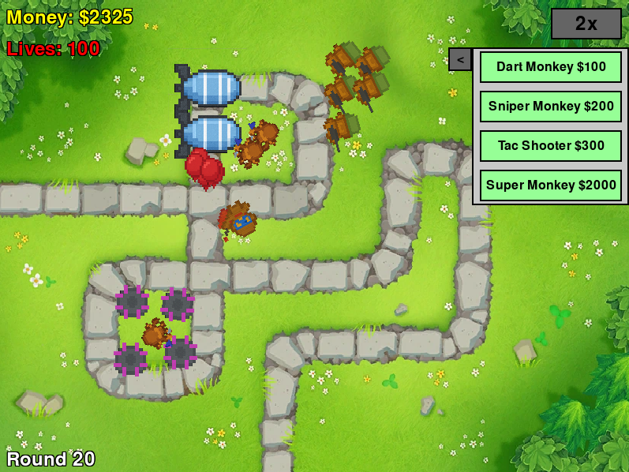

<link rel="stylesheet" href="style.css">

<header class="site-header">
  <h1>Balloons Tower Defense</h1>
  <nav class="site-nav">
    <a href="#about">About</a>
    <a href="#features">Features</a>
    <a href="#gameplay">Gameplay</a>
    <a href="#installation">Installation</a>
    <a href="#attributions">Attributions</a>
  </nav>
</header>

## About {#about}

A simple tower-defense game built in **Python** using **Pygame**, inspired by Ninja Kiwi’s Bloons TD. Strategically place and upgrade towers to defend against waves of colorful balloons racing along custom paths!

## Features {#features}

- **Four tower types**, each with unique behavior:

  <figure class="tower-item">
    
    <figcaption>Dart Monkey</figcaption>
  </figure>
  <figure class="tower-item">
    
    <figcaption>Sniper Monkey</figcaption>
  </figure>
  <figure class="tower-item">
    
    <figcaption>Tac Shooter</figcaption>
  </figure>
  <figure class="tower-item">
    
    <figcaption>Super Monkey</figcaption>
  </figure>

- **Six balloon enemy types** with increasing toughness:

  <figure class="balloon-item">
    
    <figcaption>Red Balloon</figcaption>
  </figure>
  <figure class="balloon-item">
    
    <figcaption>Blue Balloon</figcaption>
  </figure>
  <figure class="balloon-item">
    
    <figcaption>Green Balloon</figcaption>
  </figure>
  <figure class="balloon-item">
    
    <figcaption>Yellow Balloon</figcaption>
  </figure>
  <figure class="balloon-item">
    
    <figcaption>Pink Balloon</figcaption>
  </figure>
  <figure class="balloon-item">
    
    <figcaption>MOAB Boss</figcaption>
  </figure>

- **20 configurable rounds** with varying spawn patterns  
- **Interactive UI**: place, upgrade, sell towers & toggle game speed  

## Gameplay {#gameplay}

Watch the action in motion!  
[▶️ Watch gameplay video](https://youtu.be/<your-video-id>)

  <!-- Screenshot 1 -->
    
  *Early-game setup*

  <!-- Screenshot 2 -->
    
  *Mid-game boss wave*

  <!-- Screenshot 3 -->
    
  *Late-game chaos*

## Installation {#installation}

Clone the repo:  `git clone https://github.com/olincollege/BalloonTD0.git` 
Enter the folder:   `cd BalloonTD0`  
Install dependencies:   `pip install -r requirements.txt`  
Run the game:   `python main.py`  

## Attributions {#attributions}

We gratefully acknowledge **Ninja Kiwi** for the original **Bloons Tower Defense** concept, which served as our inspiration whenever we debated how to implement core mechanics. For more info:  

[https://ninjakiwi.com/Games/Mobile/Bloons-Tower-Defense-5.html](https://ninjakiwi.com/Games/Mobile/Bloons-Tower-Defense-5.html)

### Author Credits
 **Hong Yi Zhang** — [https://github.com/tastychez](https://github.com/tastychez)   
 **Michael Ku Jr.** — [https://github.com/Mikey-Ku](https://github.com/Mikey-Ku)  
 **Jackson Gamache** — [https://github.com/jackson-gamache](https://github.com/jackson-gamache) 

<!-- Smooth scrolling & header offset fix -->

